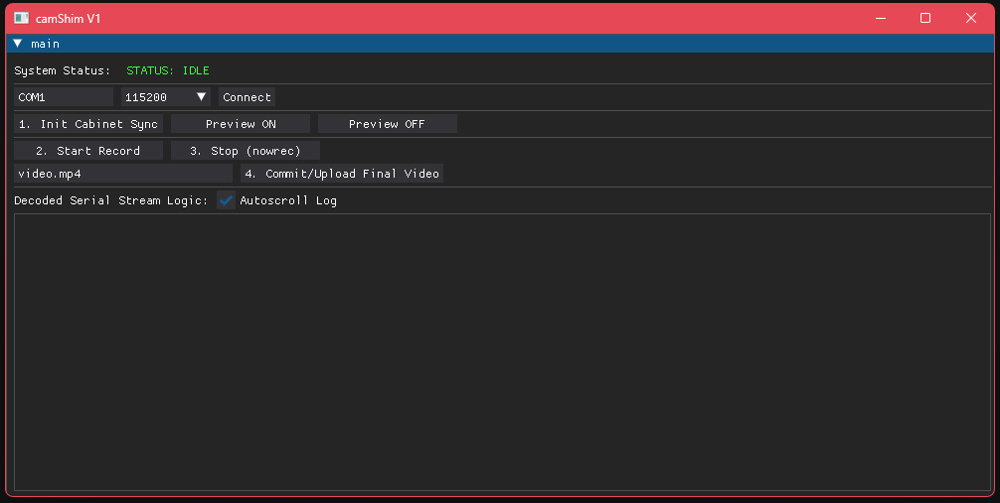

# camShim
finale cam control

# Dependencies 
```
pip install dearpygui pyserial
```

# Usage

```
py camShim.py
```

# Files
The camera hosts a FTP server on `192.168.103.201:21`
```
User: root
Pass: movieCam
MAC: 00:D0:F1:19:04:09 (may be different for your camera)
```
Video files are kept in `/home/root/movie`

Videos are also accessessible by plugging the SD card into your PC.

# WARNING!
While it has been tested and confirmed working on my hardware and shouldn't do any sort of damage, Do use this at your own risk.
AI Slop warning as well lol.

# TODO
Cam Position, FTP downloader (?)
